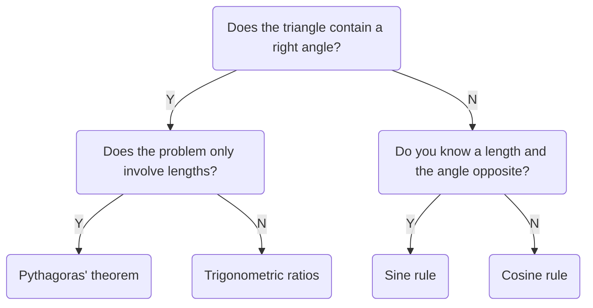

+++
title = "MST124 Unit 4 - Trigonometry"
date = 2021-12-08
draft = false
template = "docs/page.html"

[extra]
toc = false 
top = false
+++

# 1 Right-angled triangles
## 1.1 Radians and degrees
An unbroken piece of a circumference of a circle is called an **arc**. The angle at the centre is said to be **subtended** by the arc.

One **radian** is the angle subtended at the centre of a circle by an arc that has the same length as the radius.

Given the circumference of a circle is $2\pi r$ and each arch of length $r$ subtends 1 radian then the number of radians in full circle is:
$$
\frac{2\pi r}{r} = 2\pi = 360^{\circ}
$$
This gives:
$$
1~\text{radian} = \frac{360^{\circ}}{2\pi} = \frac{180^{\circ}}{\pi} = 57.295... \approx 57^\circ
$$

The number of radians in a fraction of full turn can be expressed in terms of $\pi$, e.g. $120^{\circ}= 2\pi/3$, $30^{\circ}= 2\pi/12 = \pi/6$, $90^\circ = \pi/2$...

#### Converting between degrees and radians
* number of radians $= \frac{\pi}{180} \times$ number of degrees
* number of degrees $= \frac{180}{\pi} \times$ number of radians

#### Length of an arc of a circle
$$
\text{arc length} = r\theta
$$
where $r$ is the radius of the circle and $\theta$ is the angle subtended by the arc, measured in radians.

#### Area of a sector of a circle
$$
\text{area of sector} = \frac{1}{2}r^2\theta
$$

## 1.2 Sine, cosine and tangent
$$
\begin{align}
\sin\theta = \frac{\text{opp}}{\text{hyp}} \\\\[1em]
\cos\theta = \frac{\text{adj}}{\text{hyp}} \\\\[1em]
\tan\theta = \frac{\text{opp}}{\text{adj}} \\\\[1em]
\end{align}
$$

## 1.5 Trigonometric rations of special angles
Following special angles can be deduced without calculator:
* $\pi / 6 ~~ (30^{\circ})$
* $\pi / 4 ~~ (45^{\circ})$
* $\pi / 3 ~~ (60^{\circ})$

$\pi / 3$ is one of the angles of an *equilateral triangle* like:

The lengths of the vertical line is:
$$
\sqrt{2^2 - 1^2} = \sqrt{3}
$$
Giving:
$$
\sin\frac{\pi}{3} = \frac{\sqrt{3}}{2} ~~~ \cos\frac{\pi}{3} = \frac{1}{2} ~~~ \tan\frac{\pi}{3} = \frac{\sqrt{3}}{1} = \sqrt{3}
$$

The ratio of $\pi/6$ can be found by using same diagram:

Giving:
$$
\sin\frac{\pi}{6} = \frac{1}{2} ~~~ \cos\frac{\pi}{6} = \frac{\sqrt{3}}{2} ~~~ \tan\frac{\pi}{6} = \frac{1}{\sqrt{3}}
$$

To find the ratios of $\pi/4$, following diagram can be used:

The length of the diagonal is:
$$
\sqrt{1^2 + 1^2} = \sqrt{2}
$$

Giving:
$$
\sin\frac{\pi}{4} = \frac{1}{\sqrt{2}} ~~~ \cos\frac{\pi}{4} = \frac{1}{\sqrt{2}} ~~~ \tan\frac{\pi}{4} = \frac{1}{1} = 1
$$

#### Special angles table
|$\theta$ in radians|$\theta$ in degrees|$\sin\theta$|$\cos\theta$|$\tan\theta$|
|---|---|---|---|--- |
|$\frac{\pi}{6}$|$30^{\circ}$|$\frac{1}{2}$|$\frac{\sqrt{3}}{2}$|$\frac{1}{\sqrt{3}}$|
|$\frac{\pi}{4}$|$45^{\circ}$|$\frac{1}{\sqrt{2}}$|$\frac{1}{\sqrt{2}}$|$1$|
|$\frac{\pi}{3}$|$60^{\circ}$|$\frac{\sqrt{3}}{2}$|$\frac{1}{2}$|$\sqrt{3}$|

It follows that e.g.
$$
\cos^{-1}(\frac{\sqrt{3}}{2}) = \frac{\pi}{6}
$$

It also follows that for any acute angle $\theta$, the value of $\sin\theta$ and $\cos\theta$ is less than 1.

## 1.6 Trigonometric identities
To find first two identities consider an acute angle $\theta$ in right-angled triangle such that

For which
$$
\sin\theta = \frac{a}{1} = a ~~,~~ \cos\theta = \frac{b}{1} = b ~~,~~ \tan\theta = \frac{a}{b}
$$

It follows that
$$
\frac{\sin\theta}{\cos\theta} = \frac{a}{b} = \tan\theta
$$
Giving the first identity.

Second identity can be found by applying the Pythagora's theorem:
$$
a^2 + b^2 = 1^2 = 1
$$
Hence it follows that
$$
(\sin\theta)^2 + (\cos\theta)^2 = 1
$$
Giving the second identity.

For next two identities consider:

Where:
$$
\sin\theta=\frac{a}{c} ~~ \cos\theta=\frac{b}{c}
$$
Leading to next two identities:
$$
\sin(\frac{\pi}{2} - \theta) = \frac{b}{c} = \cos\theta ~~ \cos(\frac{\pi}{2} - \theta) = \frac{a}{c} = \sin\theta
$$

#### List of trigonometric identities
$$
\begin{align}
\frac{\sin\theta}{\cos\theta} &= \tan\theta \\\\[1em]
\sin^2\theta + \cos^2\theta &= 1 \\\\[1em]
\sin(\frac{\pi}{2} - \theta) &= \cos\theta \\\\[1em]
\cos(\frac{\pi}{2} - \theta) &= \sin\theta \\\\[1em]
\end{align}
$$

# 2 Trigonometric functions
## 2.1 Angles of any size
Besides acute and right angles we can have:
* **obtuse** angles (between $\pi/2$ and $\pi$)
* **straight** angles ($\pi$)
* **reflex** angles (between $\pi$ and $2\pi$)

There can also be angles larger than $2\pi$ or negative angles like $-\pi$.

The first step to find trigonometric rations of any angle is to associate a particular point $P$ with angle $\theta$ on the **unit circle**.

## 2.2 Sine, cosine and tangent of any angle

#### Sine, cosine and tangent
Suppose that $\theta$ is any angle and $(x, y)$ are the coordinates of its associated point $P$ on the unit circle. Then
$$
\sin\theta = y~,~~ \cos\theta = x, \\\\
$$
and, provided that $x \ne 0$,
$$
\tan\theta = \frac{y}{x}
$$
(If $x = 0$, then $\tan\theta$ is undefined.)

#### ASTC diagram
Indicates which of the $\sin\theta$, $\cos\theta$ and $\tan\theta$ are positive.

Suppose that $\theta$ is an angle whose associated point $P$ does not lie on either the $x$- or $y$-axis, and $\phi$ is the acute angle between $OP$ and the $x$-axis. Then
$$
\begin{align}
\sin\theta = \pm\sin\phi \\\\[0.5em]
\cos\theta = \pm\cos\phi \\\\[0.5em]
\tan\theta = \pm\tan\phi \\\\[0.5em]
\end{align}
$$
The ASTC diagram tells you which sign applies in each case.
(The values $\sin\phi$, $\cos\phi$ and $\tan\phi$ are all positive, because $\phi$ is acute.)

## 2.3 Graphs of sine, cosine and tangent
Sine, cosine and tangent are **trigonometric functions** (rules with inputs and outputs).

### The graph of the sine function

$\sin\theta$ is the $y$-coordinate of point $P$ on unit circle.
As the angle $\theta$ increases from $0$ to $2\pi$, the point $P$ rotates from positive $x$-axis. Its $y$-coordinate oscillates from 0 to 1 to 0 to -1 and back to 0.

The graph oscillates endlessly since $\sin(\theta + 2\pi) = \sin\theta$ hence it's **periodic** with **period** $2\pi$.

### The graph of the cosine function

$\cos\theta$ is the $x$-coordinate of the point $P$ on the unit circle. It's periodic with period $2\pi$.

### The graph of the tangent function

The graph is periodic with period of $\pi$. The breaks in graph occur when $\theta = \pi/2 + n\pi$ for some integer $n$. These are the values of $\theta$ for which $\tan\theta$ is undefined because the $x$-coordinate of the point $P$ is zero.

### Using the variables $x$ and $y$ for trigonometric functions
Sometimes it's convenient to use the letter $x$ to denote the input variable and the letter $y$ to denote the output variable:

$$
y = \sin x ~~ y = \cos x ~~ y = \tan x
$$

## 2.4 Inverse trigonometric functions
In general if a function $f$ is one-to-one, then it has an *inverse function* $f^{-1}$, whose rule is give by
$$
f^{-1}(y) = x ~~~\text{where}~~~ f(x) = y
$$
The sine, cosine and tangent aren't one-to-one, e.g.:

To obtain 'sort of inverse function' we need to specify new function with same rule but limited domain - a *restriction*:

It has same image set as the sine function $[-1, 1]$ and it's increasing on the whole domain, so it's one-to-one. Hence it has an inverse function called the **inverse sine function** denoted by $\sin^{-1}$. 

The graph of $y = \sin^{-1}(x)$ is reflection of $y = \sin(x)$ in the line $y = x$ (as with any other inverse function).

### Inverse sine
The **inverse sine function** $\sin^{-1}$ is the function with domain $[-1, 1]$ and rule
$$
\sin^{-1}x = y
$$
where $y$ is the number in the interval $[-\pi/2, \pi/2]$ such that $\sin y=x$.

### Inverse cosine
The **inverse cosine function** $\cos^{-1}$ is the function with domain $[-1, 1]$ and rule
$$
\cos^{-1} x = y
$$
where $y$ is the number in the interval $[0, \pi]$ such that $\cos y = x$

### Inverse tangent
The **inverse tangent function** $\tan^{-1}$ is the function with domain $\mathbb{R}$ and rule
$$
\tan^{-1} x = y
$$
where $y$ is the number in the interval $(-\pi/2, \pi/2)$ such that $\tan y = x$.

#### Identities with negative inputs
$$
\begin{align}
\sin^{-1}(-x) &= -\sin^{-1}x \\\\[0.4em]
\cos^{-1}(-x) &= \pi -\cos^{-1}x \\\\[0.4em]
\tan^{-1}(-x) &= -\tan^{-1}x \\\\[0.4em]
\end{align}
$$

## 2.5 Solving simple trigonometric equations
Like:
$$
\sin\theta=\frac{1}{2},~~~\cos\theta=0.3,~~~\tan\theta=-1
$$
One solution can be found by applying an inverse trigonometric function:
$$
\theta = \sin^{-1}\frac{1}{2} = \frac{\pi}{6}
$$
However there are infinitely many other solutions since the sine is periodic.
Hence it's the best to start by finding all the solutions in the interval of length $2\pi$, such as $[0, 2\pi]$ or $[-\pi, \pi]$ (there are usually two).
Additional solutions ca be found by adding integer multiples of $2\pi$.

# 3 Sine and cosine rules
## 3.1 The sine rule

$$
\begin{align}
\sin A &= \frac{h}{b}, ~~\text{so}~~ h = b\sin A \\\\[0.4em]
\sin B &= \frac{h}{a}, ~~\text{so}~~ h = a\sin B \\\\[0.4em]
\text{hence} \\\\[0.4em]
b\sin A &= h = a \sin B \\\\[0.4em]
\frac{a}{\sin A} &= \frac{b}{\sin B}
\end{align}
$$

In same way, the line $h$ can be raised from other vertices and similar equation deduced.

### Sine rule
$$
\frac{a}{\sin A} = \frac{b}{\sin B} = \frac{c}{\sin C} 
$$

### Using the sine rule to find a side length
You can use the sine rule to find an unknown side length of a triangle if you know
* the opposite angle
* another side length and its opposite angle. 

### Using the sine rule to find an angle
You can use the sine rule to find an unknown angle in a triangle if you know:
* the opposite side length
* another side length and its opposite angle.

Sometimes you also need to know whether the unknown angle is acute or obtuse.

## 3.2 The cosine rule

$$
\begin{align}
b^2 &= y^2 + h^2 \\\\
a^2 &= (c - y)^2 + h^2 \\\\
\end{align}
$$
Expanding the brackets in second term gives
$$
a^2 = c^2 - 2cy + y^2 + h^2
$$
Since $y^2 + h^2 = b^2$ it follows that
$$
a^2 = c^2 - 2cy + b^2 = b^2 + c^2 - 2cy
$$
Next
$$
\cos A = \frac{y}{b}, ~~\text{so} ~~ y = b\cos A
$$
Substituting gives
$$
a^2 = b^2 + c^2 - 2bc\cos A
$$

#### Cosine rule
$$
\begin{align}
a^2 = b^2 + c^2 - 2bc\cos A \\\\
b^2 = c^2 + a^2 - 2ca\cos B \\\\
c^2 = a^2 + b^2 - 2ab\cos C \\\\
\end{align}
$$

### Using the cosine rule to find a side length
You can use the cosine rule to find an unknown side length of a triangle if you know the other two side lengths and the angle between them.

### Using the cosine rule to find an angle
You can use the cosine rule to find an unknown angle if you know all three side lengths.

### Triangle solving tree

## 3.3 The area of triangle
For a triangle,
$$
\text{area} = \frac{1}{2} \times \text{base} \times \text{height}
$$

$$
\sin\theta = \frac{h}{a},~~~\text{so}~~ h = a\sin\theta
$$
Hence
### Area of triangle
For a triangle with an angle $\theta$ between two sides of lengths $a$ and $b$,
$$
\text{area} = \frac{1}{2}ab\sin\theta
$$

## 3.4 The angle of inclination of a line
is the angle that it makes with the $x$-axis, measured anticlockwise from the positive direction of the $x$-axis, when the line is drawn on axes *with equal scales*.
* a line with positive gradient has an angle of inclination between 0 and $\pi/2$
* a line with negative gradient has an angle of inclination between $\pi/2$ and $\pi$.

When a unit circle is considered:

It's known that
$$
\tan\theta = \frac{y}{x}
$$
And by the formula for gradient
$$
\text{gradient of OP} = \frac{y - 0}{x - 0} = \frac{y}{x}
$$

hence

### Gradient and angle of inclination of a straight line
For any non-vertical straight line with angle of inclination $\theta$,
$$
\text{gradient} = \tan\theta
$$
Remember that the angle of inclination is measured when the line is drawn on axes *with equal scales*.

# 4 Further trigonometric identities
## 4.1 Two simple trigonometric identities
First one is already known:
$$
\tan\theta=\frac{\sin\theta}{\cos\theta}
$$

Second can be deduced as follows:

The length of the 
* vertical side of triangle is $\sin\theta$.
* horizontal side of triangle is $-\cos\theta$

Hence by Pythagoras' theorem
$$
\begin{align}
(\sin\theta)^2 + (-\cos\theta)^2 = 1^2 \\\\
(\sin\theta)^2 + (\cos\theta)^2 = 1
\end{align}
$$

Giving the second identity:
$$
\sin^2\theta + \cos^2\theta = 1
$$

## 4.2 Trigonometric identities from the graphs of sine, cosine and tangent

Given the trigonometric functions are periodic it follow that

$$
\begin{align}
\sin(\theta + 2\pi) &= \sin\theta \\\\
\cos(\theta + 2\pi) &= \cos\theta \\\\
\tan(\theta + \pi) &= \tan\theta \\\\
\end{align}
$$

From the symmetry of the respective graphs it also follows that
$$
\begin{align}
\sin(-\theta) &= -\sin\theta \\\\
\cos(-\theta) &= \cos\theta \\\\
\tan(-\theta) &= -\tan\theta
\end{align}
$$

Also, if the graph of cosine is translated to the left by $\pi/2$ and reflected in the vertical axis the graph of sine is obtained. Hence the equation
$$
\cos(-\theta + \frac{\pi}{2}) = \sin\theta
$$
is an identity. Similar identity can be found for since.

Hence following identities
$$
\begin{align}
\sin(\frac{\pi}{2} - \theta) = \cos\theta \\\\
\cos(-\theta + \frac{\pi}{2}) = \sin\theta
\end{align}
$$

## 4.3 Cosecant, secant and cotangent
In right angled triangle, three known trigonometric functions are defined as
$$
\sin\theta = \frac{\text{opp}}{\text{hyp}} ~~~
\cos\theta = \frac{\text{adj}}{\text{hyp}} ~~~
\tan\theta = \frac{\text{opp}}{\text{adj}} ~~~
$$

There are three further ratios **cosecant**, **secant**, **cotangent** of $\theta$:
$$
\text{cosec}\theta = \frac{\text{hyp}}{\text{opp}} ~~~
\text{sec}\theta = \frac{\text{hyp}}{\text{adj}} ~~~
\text{cot}\theta = \frac{\text{adj}}{\text{opp}} ~~~
$$

Generalized as

### Cosecant, secant and cotangent
$$
\begin{align}
\text{cosec}\theta &= \frac{1}{\sin\theta} ~~~(\text{provided} \sin\theta \ne 0) \\\\
\text{sec}\theta &= \frac{1}{\cos\theta} ~~~(\text{provided} \cos\theta \ne 0) \\\\
\text{cot}\theta &= \frac{\cos\theta}{\sin\theta} ~~~(\text{provided} \sin\theta \ne 0) \\\\
\end{align}
$$

Given
$$
\tan\theta = \frac{\sin\theta}{\cos\theta}
$$

it follows that
$$
\cot\theta = \frac{1}{\tan\theta} ~~~ (\text{provided} \sin\theta\ne0 ~\text{and} \cos\theta\ne0)
$$

Essentially cosecant, secant and cotangent are the reciprocals of the sine, cosine and tangent functions (with same periods).

Two new identities can be obtained by taking previous identity
$$
\sin^2\theta + \cos^2\theta = 1
$$
dividing both sides by $\cos^2\theta$
$$
\frac{\sin^2\theta}{\cos^2\theta} + \frac{\cos^2\theta}{\cos^2\theta} = \frac{1}{\cos^2\theta}
$$
that is
$$
\tan^2\theta + 1 = \sec^2\theta
$$

Hence following identities
$$
\begin{align}
\tan^2\theta + 1 &= \sec^2\theta \\\\
1 + \cot^2\theta &= \text{cosec}^2\theta
\end{align}
$$

## 4.4 Angle sum and angle difference identities
### Angle sum identities for sine and cosine
$$
\begin{align}
\sin(A + B) = \sin A \cos B + \cos A \sin B \\\\
\cos(A + B) = \cos A \cos B - \sin A \sin B
\end{align}
$$

### Angle sum identity for tangent
$$
\tan(A + B) = \frac{\tan A + \tan B}{1 - \tan A \tan B}
$$

### Angle difference identities
$$
\begin{align}
\sin(A + B) = \sin A \cos B - \cos A \sin B \\\\
\cos(A - B) = \cos A \cos B + \sin A \sin B \\\\
\tan(A - B) = \frac{\tan A - \tan B}{1 + \tan A \tan B}
\end{align}
$$

## 4.5 Double-angle and half-angle identities
### Double-angle identities
$$
\begin{align}
\sin(2\theta) &= 2\sin\theta\cos\theta \\\\
\cos(2\theta) &= \cos^2\theta - sin^2\theta \\\\
\tan(2\theta) &= \frac{2\tan\theta}{1 - \tan^2\theta}
\end{align}
$$

### Alternative double-angle identities for cosine
$$
\begin{align}
\cos(2\theta) = 1 - 2\sin^2\theta \\\\
\cos(2\theta) = 2\cos^2\theta - 1
\end{align}
$$

### Half-angle identities
$$
\begin{align}
\sin^2\theta = \frac{1}{2}(1 - \cos(2\theta)) \\\\
\cos^2\theta = \frac{1}{2}(1 + cos(2\theta))
\end{align}
$$
